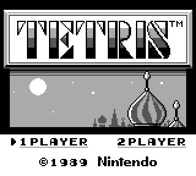
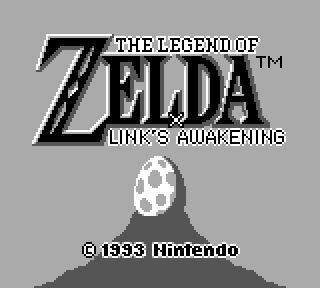
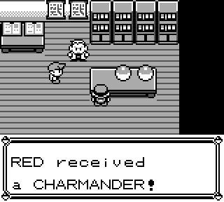
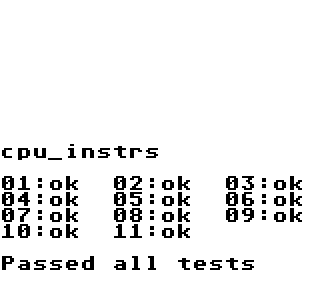
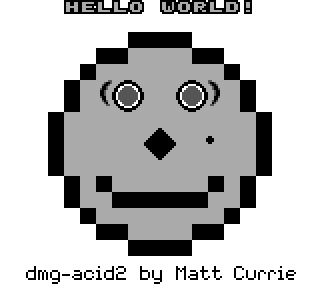

# CorrodedBoy, a Gameboy Emulator written in Rust
[Try out the emulator online here!](https://wsandst.com/gameboy)

CorrodedBoy is a Gameboy (DMG) Emulator written in Rust. The emulator has two available frontends: one native frontend using SDL2, and a web frontend (through WASM) written in Javascript. The emulator is decently accurate, but lacks certain CPU and GPU cycle accuracies.
  
# [Video showcase](https://www.youtube.com/watch?v=mhybl6--UUI)

## Functionality
**Tetris**, **Dr Mario** and **Super Mario Land**, **The Legend of Zelda: Link's Awakening** and **Pokemon Red** have been tested and work well. Most other DMG games should also work.
### Implemented parts:
* Complete CPU implementation, lacking certain cycle accuracies. Passes the blargg cpu_instrs and instr_timing test ROMs, but not the mem_timing.
* Complete GPU implementation, passes Acid2 test rom
* Complete sound implementation
* Interrupts
* Timer
* Joypad input
* ROM-only, MBC1 and MBC3 rom support  
* Optional bootrom  
* Savestates using Serialization
* CPU debugging tool  
* Native frontend (using SDL2)  
* Web frontend (through WASM, Canvas, WebAudio)  

## Test roms
Passing blargg cpu_instrs and instr_timing. Large refactor needed to pass mem_timing. 
Passes Acid2 GPU test (except for sprite x-ordering which has been intentionally left out due to planned future Gameboy Color support).  

## Frontend options
### Native
Uses SDL2 in Rust for Graphics, Input and Sound.

### Web
Compiles the emulator core to WASM and uses wasm-pack to create a NPM module interface to the emulator.
This module is then used to create a Javascript frontend, which uses Canvas and WebAudio.

## Build instructions
### Native
`cargo build --release --package gb-emulator-native`  
Run:  
`./target/release/gb-emulator-native`

### Web
`cd frontend_web`  
`wasm-pack build`  
Run:  
`cd frontend_web/site`   
`npm install`  
`npm run develop`

## Key bindings  
| Key           | Action        |
| ------------- |:-------------|
<kbd>W</kbd>  | Up  
<kbd>S</kbd>  | Down
<kbd>A</kbd>    | Left  
<kbd>D</kbd>    | Right  
<kbd>Space</kbd> or <kbd>Z</kbd>  | A  
<kbd>Shift</kbd> or <kbd>X</kbd>  | B  
<kbd>Enter</kbd> | Start  
<kbd>Shift</kbd> | Select  
<kbd>Ctrl</kbd>  | Speedup  
<kbd>P</kbd>     | Pause/unpause 
<kbd>O</kbd>     | Toggle audio
<kbd>F1</kbd>    | Save Game  
<kbd>F2</kbd>    | Screenshot  

## Future work
- [ ] Implement bandlimited interpolation for simple_buf, which would improve web audio.
- [ ] Implement proper frequency modulation audio sync for web frontend
- [ ] MBC RTC support (for Pokemon Gold)
- [ ] Implement halting bug correctly
- [ ] Implement proper FIFO GPU pipeline
- [ ] Gameboy Color support

### Resources
https://www.youtube.com/watch?v=HyzD8pNlpwI  
https://gbdev.io/pandocs/  
https://gbdev.gg8.se/wiki/articles/Main_Page  
http://imrannazar.com/GameBoy-Emulation-in-JavaScript  
https://izik1.github.io/gbops/