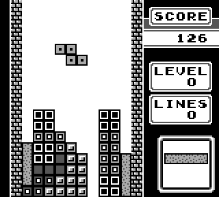

# CorrodedBoy, a Gameboy Emulator written in Rust
Gameboy Emulator written in Rust. The emulator has two available frontends: one native using SDL2, and a web frontend (through WASM) written in Javascript. The emulator is still in development.  
  

## Functionality
**Tetris**, **Dr Mario** and **Super Mario Land**, **The Legend of Zelda: Links Awakening** and **Pokemon Red** have been tested and work quite well.
### Implemented parts:
* Mostly complete CPU implementation, lacking certain cycle accuracies. Passes the blargg cpu_instrs and instr_timing test ROMs, but not the mem_timing.
* Interrupts
* Timer
* Joypad input
* Mostly complete GPU implementation, passes Acid2 test rom
* Almost complete sound, in development. Currently only the wave channel is missing and sound syncing is a bit off
* MBC1 and MBC3 rom support  
* Optional bootrom  
* Savestates using Serialization
* CPU debugging tool
* Native frontend (using SDL2)
* Web frontend (through WASM)

## Todo:
- [X] Improve tile graphics GPU drawing
- [X] More advanced GPU sprite functionality
- [x] Pass acid2 GPU test
- [x] Pulse-wave sound channel implemention
- [x] Noise sound channel implementation
- [X] Wave sound channel implementation
- [ ] Complete sound core implementation
- [x] Sound frontend integration
- [x] Improve sound/video syncing
- [ ] Polish sound/video syncing
- [ ] Implement sound syncing for web frontend
- [X] Savestates using Serialization
- [X] Partial MBC3 support
- [ ] MBC3 Real-time clock support (for Pokemon Gold)

## Test roms
Passing blargg cpu_instrs and instr_timing. Large refactor needed to pass mem_timing. 
Passes Acid2 GPU test (except for x ordering which has been intentionally left out due to planned Gameboy Color support).  

## Frontend options
### Native
Uses SDL2 in Rust for Graphics, Input and Sound.

### Web
Compiles the emulator core to WASM and uses wasm-pack to create a NPM module interface to the emulator.
This module is then used to create a Javascript frontend. Currently uses Canvas and WebAudio.

## Build instructions
### Native
`cargo build --release --package gb-emulator-native`  
Run:  
`./target/release/gb-emulator-native`

### Web
`cd frontend_web`  
`wasm-pack build`  
Run:  
`cd frontend_web/site`   
`npm install`  
`npm run develop`

### Resources
https://www.youtube.com/watch?v=HyzD8pNlpwI  
https://gbdev.io/pandocs/  
https://gbdev.gg8.se/wiki/articles/Main_Page  
http://imrannazar.com/GameBoy-Emulation-in-JavaScript  
https://izik1.github.io/gbops/